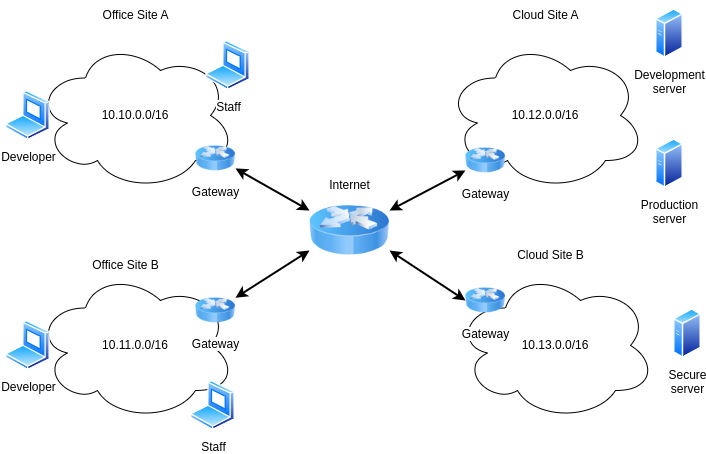

# TP2



## Useful commands

#####  `docker compose up --build -d` 
Start the lab
##### `docker compose down`
 Stop the lab
##### `docker compose ps`
Shows the services available. Use the (`SERVICE`) field to understand the services that are available. 

Example:
```bash
NAME                              IMAGE                                                                COMMAND                   SERVICE            CREATED          STATUS         PORTS
tp2-firewall-developerA-1         jackops93/netsetalpine:v1.0.0                                        "sh -c 'ip route add…"    developerA         24 minutes ago   Up 4 minutes   
tp2-firewall-developerB-1         jackops93/netsetalpine:v1.0.0                                        "sh -c 'ip route add…"    developerB         24 minutes ago   Up 4 minutes   
tp2-firewall-devserver-1          jackops93/netsecnginx:v1.0.0                                         "sh -c 'ip route add…"    devserver          13 minutes ago   Up 4 minutes   80/tcp
tp2-firewall-gsiteA-1             jackops93/netsetalpine:v1.0.0                                        "sh -c 'sysctl -w ne…"    gsiteA             24 minutes ago   Up 4 minutes   
tp2-firewall-gsiteB-1             jackops93/netsetalpine:v1.0.0                                        "sh -c 'sysctl -w ne…"    gsiteB             24 minutes ago   Up 4 minutes   
tp2-firewall-gwcloudA-1           jackops93/netsetalpine:v1.0.0                                        "sh -c 'sysctl -w ne…"    gwcloudA           24 minutes ago   Up 4 minutes   
tp2-firewall-gwcloudB-1           jackops93/netsetalpine:v1.0.0                                        "sh -c 'sysctl -w ne…"    gwcloudB           24 minutes ago   Up 4 minutes   
tp2-firewall-productionserver-1   jackops93/netsecnginx:v1.0.0                                         "sh -c 'ip route add…"    productionserver   13 minutes ago   Up 4 minutes   80/tcp
tp2-firewall-router-1             jackops93/netsetalpine:v1.0.0                                        "sh -c 'sysctl -w ne…"    router             24 minutes ago   Up 4 minutes   
tp2-firewall-secureserver-1       registry.gitlab.com/dasskelett/nginx-quic-docker/nginx-quic:latest   "sh -c '\n  ip route …"   secureserver       11 minutes ago   Up 4 minutes   80/tcp, 443/tcp, 443/udp
tp2-firewall-staffA-1             jackops93/netsetalpine:v1.0.0                                        "sh -c 'ip route add…"    staffA             24 minutes ago   Up 4 minutes   
tp2-firewall-staffB-1             jackops93/netsetalpine:v1.0.0                                        "sh -c 'ip route add…"    staffB             24 minutes ago   Up 4 minutes  
```

- `docker compose exec -it <service_name> bash` Get a shell in a container
>  Example: `docker compose exec -it staffA bash` gives you access to a shell in the staffA container (you can use `exit` to exit the container)

### Commands in detail

The `-it` option in the docker compose command combines two flags:

-i: Interactive mode. It keeps the stdin open for the container, allowing you to interact with it.
-t: This allocates a pseudo-TTY and simulates command-line interface.

### Once inside the container you can run: 
- `bash /scripts/check_reachability.sh` to check if the container can reach the other targets (by default it should )
- `tcpdump` to analyze the network traffic. You are encouraged to look the [manual online](https://www.tcpdump.org/manpages/tcpdump.1.html). You can store locally the results of tcpdump by saving them in `/exports` folder of every container. You can then analyze the traffic using Wireshark.
