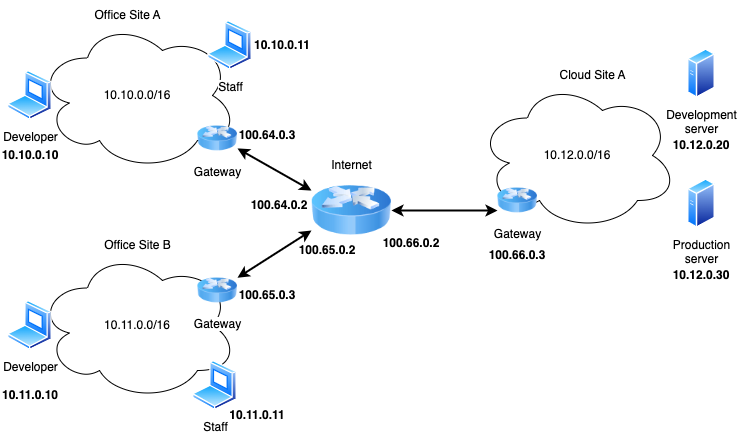

# Exercise 3

## Useful commands

#####  `docker compose up --build -d` 
Start the lab
##### `docker compose down`
 Stop the lab
##### `docker compose ps`
Shows the services available. Use the (`SERVICE`) field to understand the services that are available. 

- `docker compose exec -it <service_name> bash` Get a shell in a container
>  Example: `docker compose exec -it staffA bash` gives you access to a shell in the staffA container (you can use `exit` to exit the container)

### Commands in detail

The `-it` option in the docker compose command combines two flags:

-i: Interactive mode. It keeps the stdin open for the container, allowing you to interact with it.
-t: This allocates a pseudo-TTY and simulates command-line interface.

### Once inside the container you can run: 
- `bash /scripts/caniping.sh` to check if the container can reach the other targets (by default they should be able to reach the gateways and the local neighbours )
- `tcpdump` to analyze the network traffic. You are encouraged to look the [manual online](https://www.tcpdump.org/manpages/tcpdump.1.html). You can store locally the results of tcpdump by saving them in `/exports` folder of every container. You can then analyze the traffic using Wireshark.

## Instructions

You will implement an OpenVPN server in the `gwcloudA` container. Then, you will add developerA and developerB to the vpn as clients. 

> Note: Developers of Site A should be granted access to both Production and Development server,while developers on Site B should only access the Development server.